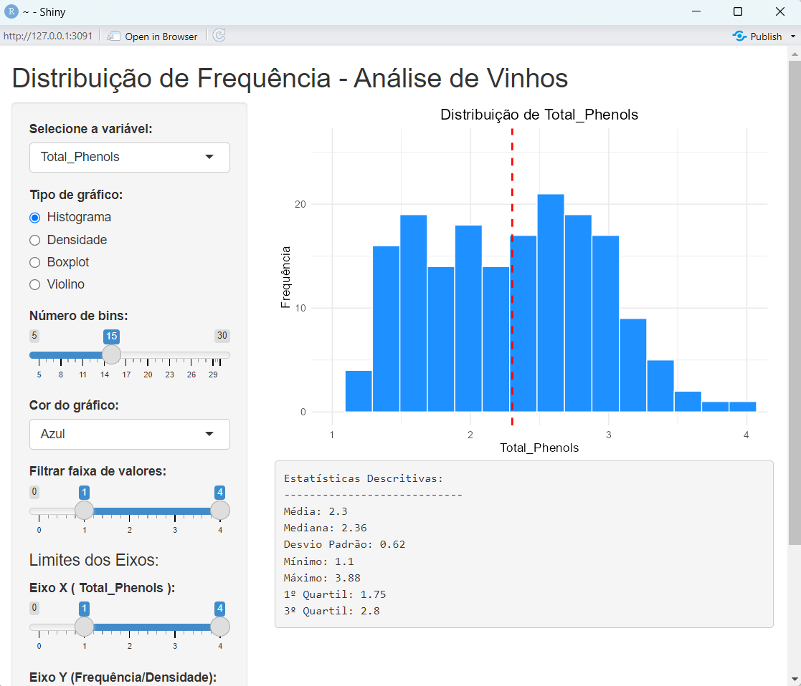

```{r setup, include=FALSE}
knitr::opts_chunk$set(echo = TRUE)
```

### **PROJETO DA DISCIPLINA**

### Análise de Dados

#### Aluno: MARIA CLARA SILVA SOBREIRA

Nessa disciplina, foram somados ao conhecimento de anáise exploratória de dados, aspectos importantes do dia a dia de um cientista de dados: distribuição dos dados, imputação de dados, visualização de dados, construção de dashboards e relatórios.


#### Base de dados

A escolha do dataset de vinhos foi motivada pela possibilidade de analisar as variáveis que representam características físico-químicas de vinhos, como teor alcoólico, acidez e compostos fenólicos. Essa base é comumente utilizada para a classificação de vinhos em 3 tipos, mas neste trabalho o foco está na análise exploratória dos dados, tal como é o proposto para a disciplina.

Dessa maneira, espera-se encontrar insights a partir das variáveis Álcool, Acidez Málica, Intensidade da cor e dos compostos fenólicos (Total_Phenols e Flavanoids). Também espera-se analisar as estatísticas descritivas de variáveis numéricas, como:

- média do teor alcoólico, indicando vinhos mais fortificados ou suaves;
- dispersão da acidez málica, verificando as diferenças significativas entre os vinhos; e,
- correlação entre as variáveis Phenols e Flavanoids, pois vinhos com mais fenólicos tendem a ser mais adstringentes.
    

```{r Banco de Dados, echo=FALSE}
#carregar arquivo
filename <- "./wine.csv"

df <- read.csv(filename,   sep=",")
dfc <- df[,-1]
dfs <- scale(dfc)

#colunas
colnames(df)

wine <- df[, c("Alcohol", "Malic_Acid", "Total_Phenols", "Flavanoids", "Color_Intensity")]


```
- Apresentando as primeiras linhas do banco de dados de Vinhos.

```{r imprimindo as variaveis, echo = FALSE}
head(wine)

summary(wine)
```
## Identificando os tipos de cada variável na base

- A função diagnose foi utilizada para identificar tipos de variável, unicidade e proporção de *missing values*.

Como a base original não possui dados faltantes, precisei gerar valoros vazios (aleatoriamente) para a variável  "Malic_Acid".

```{r Misssing values, echo=FALSE}
# Definir semente para reprodutibilidade
set.seed(123)

# Escolher colunas para inserir NAs (ex: "Alcohol", "Malic")
colunas_com_na <- c("Malic_Acid")

# Definir a proporção de NAs (ex: 10%)
prop_na <- 0.10

# Adicionar NAs aleatoriamente
for (col in colunas_com_na) {
  wine[sample(nrow(wine), prop_na * nrow(wine)), col] <- NA
}

```


```{r identificando os tipos de variáveis, echo = FALSE, warning=FALSE, results='asis'}

#install.packages("dlookr")
#install.packages("tidyverse") 

library(dlookr)
library(tidyverse)
library(dplyr)

# Verificar a estrutura dos dados
#str(wine)

# Diagnóstico das variáveis
dlookr::diagnose(wine)

diagnose(wine) %>% filter(missing_count > 0)


#Boxplot
library(gridExtra)
variaveis <- names(wine)

# Criar uma lista de boxplots
plots <- lapply(variaveis, function(var) {
  ggplot(wine, aes(y = .data[[var]])) +
    geom_boxplot(fill = "skyblue", color = "black") +
    labs(title = var, y = "") +
    theme_minimal()
})

# Exibir os gráficos em uma única janela (2x3)
grid.arrange(grobs = plots, ncol = 2)

```

## Análise de frequências da variável  **Ácido Málico** (com dados faltantes)

- Utilizado a função freq() do pacote summarytools para calcular as frequências relativas

As variáveis Alcool e Total_Phenols apresentam as frequencias semelhantes a uma distribuição normal.

```{r frequencias de uma variavel, echo = FALSE, warning=FALSE, results='asis', error=FALSE}

library(summarytools)

#Frequencia do acido malico
wine %>% dplyr::select(Malic_Acid) %>% 
  summarytools::freq(style = "rmarkdown", headings = FALSE, plain.ascii = FALSE) 

a <- wine %>% dplyr::select(Alcohol) %>% 
  summarytools::freq(style = "rmarkdown", headings = FALSE, plain.ascii = FALSE) 

c <- wine %>% dplyr::select(Total_Phenols) %>% 
  summarytools::freq(style = "rmarkdown", headings = FALSE, plain.ascii = FALSE) 

d <- wine %>% dplyr::select(Flavanoids) %>% 
  summarytools::freq(style = "rmarkdown", headings = FALSE, plain.ascii = FALSE) 

f <- wine %>% dplyr::select(Color_Intensity) %>% 
  summarytools::freq(style = "rmarkdown", headings = FALSE, plain.ascii = FALSE)
```
Pela frequência relativa, nota-se que 9,5% (17 das 178 observações) dos dados de  **ácido málico ** estão sem valor na base de Vinhos e 30% dos dados apresentam valores em torno de  1,67.


## Análise descritiva e de histogramas de uma variável contínua

- Variável Alcool é analisada descritivamente. 

- A centralidade dos dados, a dipersão, a assimetria, bem como as estatísticas de ordem são calculadas, a fim de ter uma leitura acerca da distribuição dessa variável.

A média do teor alcoólico é de 13%, com desvio padrão de 0,81 e amplitude de 3.08, indicando que os dados são pouco dispersos e com a presença de vinhos mais fortificados.

Com relação aos ácidos málicos, a média é de  2.33, com valor mínimo de 0.74 e máximo de 5.80. Além disso, os as distâncias entre quartis, indicam uma grande dispersão dos dados. Assim, temos diferenças significativas entre os vinhos (características e propriedades de composição).

```{r desc variavel wine , echo = FALSE, warning = FALSE, results='asis', include = TRUE, error=FALSE}

wine %>% dplyr::select(Alcohol) %>% summarytools::descr(style = "rmarkdown") 
wine %>% dplyr::select(Malic_Acid) %>% summarytools::descr(style = "rmarkdown") 


```

```{r distribuicao das variaveis, echo = FALSE, warning=FALSE, results='asis', error=FALSE}

ggplot(wine, aes(x = Alcohol)) +
  geom_histogram(binwidth = 0.5, fill = "skyblue", color = "black") +
  labs(
    title = "Distribuição de Álcool na base",
    x = "Teor Alcoólico",
    y = "Frequência"
  )

ggplot(wine, aes(x = Malic_Acid)) +
  geom_histogram(binwidth = 0.5, fill = "lightyellow", color = "black") +
  labs(
    title = "Distribuição de Ácido malico na base",
    x = "Ácido malico",
    y = "Frequência"
  )

ggplot(wine, aes(x = Total_Phenols)) +
  geom_histogram(binwidth = 0.5, fill = "lightpink", color = "black") +
  labs(
    title = "Distribuição de Total_Phenols na base",
    x = "Total_Phenols",
    y = "Frequência"
  )

ggplot(wine, aes(x = Flavanoids)) +
  geom_histogram(binwidth = 0.5, fill = "darkblue", color = "black") +
  labs(
    title = "Distribuição de Flavanoids na base",
    x = "Flavanoids",
    y = "Frequência"
  )

ggplot(wine, aes(x = Color_Intensity)) +
  geom_histogram(binwidth = 0.5, fill = "darkred", color = "black") +
  labs(
    title = "Distribuição de Intensidade da Cor dos vinhos",
    x = "Intensidade da Cor",
    y = "Frequência"
  )

```

Pela distribuição das frequências,  nota-se um agrupamento dos dados de intensidade da cor, no qual 70% dos dados possuem valores de até 5,7. 


## Análise visual da variável Intensidade de cor

- Calculando o histograma da variável **Intensidade de cor** com o número de *bins* calculado a partir da função de Sturges.


## Função de Sturge para cálculo do número de bins:

```{r definindo as funcoes geradoras de binwidths FD e S , echo = TRUE}

sr <- function(x) {
  n <-length(x)
  return((3.49*sd(x))/n^(1/3))
}

sr (wine$Color_Intensity)

```

A base de vinhos possui 178 registros. Por esse motivo, foi aplicada a função de Sturges por ser o método que melhor se adequa em bases com poucas observações e ideal para dados com distribuição semelhante a normal. O valor de bins obtido foi igual a 1,4.


## Análise visual da variável Intensidade de cor - leitura

1. Assimetria com cauda à direita.
2. Centralidade dos dados calculada pela média sofre pouca contaminação em relação aos valores mais distantes do centro da distribuição.
3. A maior parte dos dados está concentrada em torno de 5.0, indicando que cores intensas são mais frequentes na base.
4. Embora seja uma base de poucas observações, os dados não apresentaram dispersão elevada e com a maioria dos dados está concentrada próxima ao centro da distribuição.


```{r analisando cor visualmente , echo = FALSE, results='asis'}

wine %>% dplyr::select(Color_Intensity) %>% ggplot(aes(x=Color_Intensity))+geom_histogram(aes(y = after_stat(density)) ,binwidth = sr, fill = 'darkred') + xlab('Intensidade da cor') + ylab('Densidade de Frequência') + geom_vline(xintercept=c(median(wine$Color_Intensity), mean(wine$Color_Intensity))) + annotate("text", x=median(wine$Color_Intensity) + 0.3, y=0.05, label="Mediana", angle=90) + annotate("text", x=mean(wine$Color_Intensity) + 0.3, y=0.05, label="Média", angle=90) + theme_classic()
```

## Criando a Matriz de espalhamento

```{r scatterplotMatrix, echo = FALSE, warning=FALSE, results='asis', error=FALSE}

# Instalar e carregar pacotes
#install.packages("GGally")  # Se necessário
library(GGally)

# Criar a matriz de espalhamento
ggpairs(
  wine,
  title = "Matriz de Espalhamento - Análise de Vinhos",
  lower = list(continuous = "smooth"),  # Linha de tendência nos gráficos inferiores
  diag = list(continuous = "barDiag")   # Histogramas na diagonal
)

```
Assim como era esperado para Total_Phenol e Flavanoids, as variáveis possuem forte correlação positiva, com coeficiente de correlação igual a 0,87 e um forte agrupamento dos dados em torno da reta, havendo indício de que à medida que aumenta o Total_Phenol do vinho, também pode-se aumentar os Flavanoids.

Nota-se pelo com coeficiente de correlação igual a 0.99, que ALcool e Ácido málico possuem alta correlação positiva. Contudo, o espalhamento entre as variáveis em torno da reta, indica uma grande dispersão dos dados.

Alcool e Intensidade da cor possuem uma correlação positiva fraca, de valor 0,5.

## Distruição dos dados

A distribuição normal, também chamada de distribuição gaussiana, é uma das formas de distribuição de probabilidade que descreve como os dados tendem a se agrupar em torno de uma média, seguindo um padrão simétrico e bem definido. Nesse tipo de distribuição, o lado direito é uma imagem espelhada do lado esquerdo e a medida que os valores se afastam da média tendem a ser menos frequentes.

## Gráfico Quartil-Quartil (Q-Q)

```{r analisando grafico qq , echo = FALSE, warning=FALSE, results='asis', error=FALSE}

#install.packages("ggpubr") 
library(ggpubr)

ggqqplot(
  wine$Alcohol,
  title = "Gráfico Q-Q para Alcool",
  xlab = "Quantis Teóricos (Normal)",
  ylab = "Quantis Amostrais",
  color = "skyblue",    # Cor dos pontos
  ggtheme = theme_minimal()  # Estilo do gráfico
) 

ggqqplot(
  wine$Malic_Acid,
  title = "Gráfico Q-Q para Malic_Acid",
  xlab = "Quantis Teóricos (Normal)",
  ylab = "Quantis Amostrais",
  color = "yellow",    # Cor dos pontos
  ggtheme = theme_minimal()  # Estilo do gráfico
) +
  geom_abline(intercept = 0, slope = 1, linetype = "dashed", color = "red")  # Linha de referência

ggqqplot(
  wine$Total_Phenols,
  title = "Gráfico Q-Q para Total_Phenols",
  xlab = "Quantis Teóricos (Normal)",
  ylab = "Quantis Amostrais",
  color = "lightpink",    # Cor dos pontos
  ggtheme = theme_minimal()  # Estilo do gráfico
) +
  geom_abline(intercept = 0, slope = 1, linetype = "dashed", color = "red")  # Linha de referência

ggqqplot(
  wine$Flavanoids,
  title = "Gráfico Q-Q para Flavanoids",
  xlab = "Quantis Teóricos (Normal)",
  ylab = "Quantis Amostrais",
  color = "darkblue",    # Cor dos pontos
  ggtheme = theme_minimal()  # Estilo do gráfico
) +
  geom_abline(intercept = 0, slope = 1, linetype = "dashed", color = "red")  # Linha de referência


# Gráfico Q-Q para a variável 'Color' (Color_Intensity)
ggqqplot(
  wine$Color_Intensity,
  title = "Gráfico Q-Q para Intensidade de Cor",
  xlab = "Quantis Teóricos (Normal)",
  ylab = "Quantis Amostrais",
  color = "darkred",    # Cor dos pontos
  ggtheme = theme_minimal()  # Estilo do gráfico
) +
  geom_abline(intercept = 0, slope = 1, linetype = "dashed", color = "red")  # Linha de referência


#qqnorm(wine$Color_Intensity)


#Padrão do Gráfico	vs Interpretação
#Pontos alinhados na linha	      >> Dados normais.
#Pontos acima da linha no final   >>	Cauda pesada à direita (valores altos mais extremos que o esperado).
#Pontos abaixo da linha no final  >> 	Cauda pesada à esquerda (valores baixos mais extremos).
#Curva em "S"    >>   Assimetria (dados assimétricos à direita ou esquerda).

```


## Shapiro-test

o teste de Shapiro-Wilk é  uma técnica estatística usada para avaliar a normalidade dos dados.

O shapiro-test para Alcohol e Total_Phenols, retornaram p-value de 0.02 e 0.004, respectivamente. Como os valores são inferiores a 0.05, as variãveis não possuem distribução normal.

```{r shapiro.test, echo = FALSE, warning=FALSE, results='asis', error=FALSE}

shapiro.test(wine$Alcohol)

shapiro.test(wine$Total_Phenols)


#Se p-valor < 0.05: Rejeita a normalidade.


```

## Completude de dados

A completude de dados refere-se à ausência de valores (missing values) em um conjunto de dados. Na análise exploratória de dados, a presença de dados faltantes pode impactar nas respostas e nos insights obtidos no estudo, refletindo na tomada de decisões e nas aplicações das informações. Em uma base com falta de completude, os resultados podem conter viés (quando os dados omitidos não forem aleatórios),  reduzir a significância estatística (pela exlusão do tamanho da amostra), apresentar divergências nas métricas e trazer prejuízos na construção de modelos estatísticos.


## Imputação de Dados e MICE (Multiple Imputation by Chained Equations) 

A imputação de dados é o processo de preencher valores faltantes em um conjunto de dados baseadO em padrões observados.

```{r imputed, echo = FALSE, warning=FALSE, results='asis', error=FALSE}
#install.packages("mice")
library(mice)

# Matriz de padrões de dados faltantes
#md.pattern(wine) 


imputed_data <- mice::mice(wine, m = 5, method = "pmm", maxit = 10)

# Pegar o primeiro conjunto imputado (pode-se usar qualquer um dos 'm' conjuntos)
wine_complete <-  mice::complete(imputed_data, 1)


# Comparar distribuições antes/depois
mice::stripplot(imputed_data, Malic_Acid ~ .imp, pch = 20, cex = 1.2)

#library(dlookr)
# Verificar se os NAs sumiram
summary(wine_complete$Malic_Acid)
#dlookr::diagnose(wine_complete) 


```

## Verificando a base de  **álcool ** com os dados faltantes de  **ácido málico**

Nota-se que mesmo com dados faltantes em  ácido málico, a perda de informação está bem distribuída para todos os valores de Alcool, não existindo a presença de concentração de dados faltantes nos subconjuntos (agrupados pela frequência) da variável analisada.

```{r missing values, echo = FALSE, warning=FALSE, results='asis', error=FALSE}
# comparando alcool e acido malico (apenas parte dos dados faltantes)
# Filtrar linhas com Malic = NA e selecionar 'Alcohol'
dados_filtrados <- wine %>%
  filter(is.na(Malic_Acid)) %>%
  select(Alcohol)

# Visualizar os dados filtrados
#head(dados_filtrados)
freq_faltante <- freq(
  dados_filtrados$Alcohol,
  style = "grid",  # Formato de saída
  report.nas = FALSE,  # Ocultar NAs (já filtrado)
  headings = FALSE     # Simplificar cabeçalho
)

library(ggplot2)

alcool_sem_malic <- ggplot(dados_filtrados, aes(x = Alcohol)) +
  geom_histogram(binwidth = 0.5, fill = "skyblue", color = "black") +
  labs(
    title = "Distribuição de Álcool em Vinhos com Malic_Acid Faltante",
    x = "Teor Alcoólico",
    y = "Frequência"
  )

wine %>%
  mutate(Malic_NA = ifelse(is.na(Malic_Acid), "Acido Malico N/A", "Acido Malico válido")) %>%
  ggplot(aes(x = Alcohol, fill = Malic_NA)) +
  geom_density(alpha = 0.5) +
  labs(title = "Distribuição de Alcool por Status de Malic_Acid")

```

### Dashboard Shiny




### Links 

Acesse a fonte da base de dados do trabalho - Wine Quality: 
<https://archive.ics.uci.edu/dataset/186/wine+quality>

Acesse o trabalho publicado no GitHub: 
[GitHub](https://github.com/mclarax/infnet "Plataforma de desenvolvimento colaborativo")


## FIM
